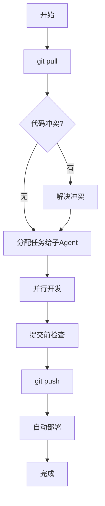

# 猎脉多Agent协作体系说明

> **最后更新**: 2026-03-28 00:23  
> **总领**: 司命大人  
> **适用范围**: 猎脉项目多电脑并行开发、跨设备协作

---

## 零、组织架构

### 0.1 猎脉三部制

**总领**：司命大人（总揽全局，战略决策）

**三大部门**：

**🏛️ 天策府**
- 主官：左护法
- 职责：产品策略、方案审核、部署验收
- 子Agent：策画郎中（产品）、审议郎中（审核）、验收郎中（部署）
- 汇报：直接向司命大人汇报

**⚔️ 神机营**
- 主官：都统（Claw）
- 职责：技术实现、代码开发、问题修复、部署运维
- 子Agent：名字、职称和工作由都统根据任务自定义
- 汇报：直接向司命大人汇报

**🛡️ 镇抚司**
- 主官：右护法（待定）
- 职责：代码审查、质量监督、性能优化
- 子Agent：名字、职称和工作由右护法根据任务自定义
- 汇报：直接向司命大人汇报

### 0.2 组织层级

- **一级**：司命大人（总领）
- **二级**：三大主官（左护法、都统、右护法）→ 直接向司命大人汇报
- **三级**：子Agent → 向各自主官汇报，名字、职称和工作由各主官自定义

### 0.3 信息共享机制

- **共享文档**：MEMORY.md、每日日志、协作规范（三方可写）
- **横向协作**：通过文档标注 `@部门` 进行跨部门沟通

### 0.4 制衡机制

- 天策府：决定"做什么"，把控质量关口，可驳回不合理的技术方案
- 神机营：决定"怎么做"，技术选型，可声明需求不可行
- 镇抚司：独立审查，否决权，可否决上线

### 0.5 部署流程

**当前状态**：自动化部署由左护法测试中，暂由神机营执行部署

**部署流程**：
1. 神机营开发完成 → 提交代码到GitHub
2. 神机营SSH连接服务器 → 拉取最新代码
3. 神机营执行部署脚本 → 验证服务状态
4. 向司命大人汇报部署结果

**未来规划**：左护法完成自动化部署后，神机营专注开发，部署由CI/CD自动执行

---

## 一、协作体系架构

### 1.1 核心设计理念

**问题**: 传统单Agent串行执行导致长时间卡顿（几小时不动）  
**解决**: 子Agent并行调度 + 即用即走模式

```
主Agent (Claw)
    ├── 子Agent A: 前端开发
    ├── 子Agent B: 后端开发
    ├── 子Agent C: 部署运维
    └── 子Agent D: 文档更新
```

### 1.2 不使用Team模式的原因

| Team模式 | 子Agent调度 | 说明 |
|---------|-----------|------|
| 持久进程 | 即用即走 | Team模式Agent常驻内存，上下文窗口持续膨胀 |
| 需要协调开销 | 直接执行 | Team模式需要消息传递、状态同步 |
| 延迟高 | 真正并行 | Team模式受限于消息队列和轮询机制 |
| 适合长期任务 | 适合独立任务 | 猎脉项目多为独立开发任务，更适合子Agent |

---

## 二、GitHub协作流程

### 2.1 每日协作流程



### 2.2 子Agent任务分配示例

**场景**: 前端页面修复 + 后端API开发 + 部署测试

```json
{
  "主Agent": {
    "角色": "协调者",
    "任务": [
      "分配任务给子Agent",
      "合并子Agent结果",
      "处理冲突",
      "更新MEMORY.md"
    ]
  },
  "子Agent-A": {
    "类型": "前端开发",
    "任务": "修复ResumeLibrary页面TypeScript错误",
    "输入": "具体错误信息",
    "输出": "修复后的代码文件"
  },
  "子Agent-B": {
    "类型": "后端开发",
    "任务": "实现积分系统API",
    "输入": "API设计文档",
    "输出": "NestJS module文件"
  },
  "子Agent-C": {
    "类型": "部署运维",
    "任务": "测试服务器部署",
    "输入": "最新代码包",
    "输出": "部署状态报告"
  }
}
```

---

## 三、具体实施指南

### 3.1 子Agent调度最佳实践

#### ✅ 推荐做法

1. **明确任务边界**
   - 每个子Agent只负责一个独立模块
   - 输入输出定义清晰
   - 避免跨模块依赖

2. **并行执行**
   ```typescript
   // 同时启动多个子Agent
   const results = await Promise.all([
     spawnSubAgent('frontend-fix', frontendTask),
     spawnSubAgent('backend-api', backendTask),
     spawnSubAgent('deploy-test', deployTask)
   ]);
   ```

3. **结果聚合**
   - 主Agent收集所有子Agent结果
   - 处理冲突（如代码合并）
   - 统一提交到GitHub

#### ❌ 避免做法

1. **任务重叠**
   - 多个子Agent修改同一文件
   - 未定义清晰的模块边界

2. **串行依赖**
   - 子Agent B依赖子Agent A的输出
   - 导致并行退化为串行

3. **过度细分**
   - 为每个小任务创建子Agent
   - 增加协调开销

### 3.2 GitHub CI/CD协作

#### 提交前检查（自动化）

```yaml
# .github/workflows/ci.yml
name: Pre-commit Check

on: [push, pull_request]

jobs:
  check:
    runs-on: ubuntu-latest
    steps:
      - uses: actions/checkout@v3
      - name: Install dependencies
        run: |
          cd backend && npm ci
          cd ../frontend-web && npm ci
      - name: Lint
        run: npm run lint
      - name: Test
        run: npm run test
      - name: Build
        run: npm run build
```

#### 自动部署（子Agent触发）

```yaml
# 自动部署到服务器
deploy:
  needs: check
  runs-on: ubuntu-latest
  steps:
    - name: Deploy to server
      uses: appleboy/ssh-action@master
      with:
        host: ${{ secrets.SERVER_HOST }}
        username: ${{ secrets.SERVER_USER }}
        key: ${{ secrets.SERVER_SSH_KEY }}
        script: |
          cd /var/www/huntlink
          git pull origin master
          docker-compose restart
```

---

## 四、跨设备协作规范

### 4.1 设备角色分工

| 设备 | 角色 | 主要任务 |
|-----|------|---------|
| 设备A (主控) | 主Agent | 任务分配、代码合并、部署管理 |
| 设备B | 前端开发子Agent | React页面开发、UI优化 |
| 设备C | 后端开发子Agent | NestJS API开发、数据库优化 |
| 设备D | 测试子Agent | 自动化测试、性能监控 |

### 4.2 冲突解决机制

#### 代码冲突

```bash
# 设备A检测到冲突
git pull origin master
# 自动合并失败，标记冲突文件

# 方案1: 主Agent手动解决
git mergetool

# 方案2: 指定子Agent解决
spawnSubAgent('conflict-resolver', {
  files: ['frontend-web/src/pages/ResumeLibrary/index.tsx'],
  strategy: 'prefer-local' // 或 'prefer-remote'
})
```

#### 依赖冲突

```json
// package.json锁定版本
{
  "dependencies": {
    "react": "18.2.0",
    "tdesign-react": "1.5.0"
  },
  "resolutions": {
    "react": "18.2.0"  // 强制统一版本
  }
}
```

---

## 五、记忆同步机制

### 5.1 MEMORY.md管理

**位置**: `.workbuddy/memory/MEMORY.md`  
**作用**: 跨设备、跨会话的长期记忆

#### 更新规则

1. **主Agent负责**: 统一更新MEMORY.md
2. **子Agent读取**: 只读访问，获取上下文
3. **冲突合并**: 多设备修改时，以最新时间为准

```markdown
# 猎脉 HuntLink 项目关键信息

## 更新日志
- 2026-03-27 23:50 (设备A): 完成前端修复，部署测试中
- 2026-03-27 22:00 (设备B): 实现积分系统API
- 2026-03-27 20:00 (设备C): 修复Docker构建问题
```

### 5.2 每日记忆文件

**位置**: `.workbuddy/memory/2026-03-27.md`  
**作用**: 当日开发记录

```markdown
# 2026-03-27 开发记录

## 已完成
- ✅ 前端TypeScript错误修复 (子Agent-A)
- ✅ 后端积分系统API (子Agent-B)
- ✅ Docker部署测试 (子Agent-C)

## 遇到的问题
- TDesign Upload组件theme="drag"不支持 → 改用"file-flow"
- JWT token验证失败 → 使用ConfigService注入

## 经验总结
- 子Agent并行执行效率高
- GitHub CI/CD自动检查避免低级错误
```

---

## 六、实际案例演示

### 案例1: 前端页面批量修复

**任务**: 修复5个页面的TypeScript错误

```typescript
// 主Agent分配任务
const pages = [
  'ResumeLibrary',
  'Profile', 
  'Messages',
  'TalentMarket',
  'TalentSearch'
];

// 并行启动5个子Agent
const results = await Promise.all(
  pages.map(page => 
    spawnSubAgent(`fix-${page}`, {
      task: `修复${page}页面的TypeScript错误`,
      file: `frontend-web/src/pages/${page}/index.tsx`,
      rules: 'TDesign组件API兼容性检查'
    })
  )
);

// 合并结果
results.forEach(r => {
  if (r.success) {
    console.log(`${r.page}修复成功`);
  }
});

// 统一提交
git add .
git commit -m "fix: 批量修复前端TypeScript错误"
git push
```

### 案例2: 后端API + 前端对接

**任务**: 实现积分系统（后端API + 前端页面）

```typescript
// 阶段1: 后端子Agent开发API
await spawnSubAgent('backend-points', {
  task: '实现积分系统API',
  modules: ['points.module.ts', 'points.service.ts', 'points.controller.ts'],
  database: 'MySQL迁移脚本'
});

// 阶段2: 前端子Agent对接页面
await spawnSubAgent('frontend-points', {
  task: '开发积分页面',
  pages: ['Points/index.tsx', 'PointsHistory/index.tsx'],
  api: '对接后端API'
});

// 阶段3: 测试子Agent集成测试
await spawnSubAgent('test-integration', {
  task: '积分系统集成测试',
  tests: ['API测试', 'UI测试', '端到端测试']
});
```

---

## 七、性能监控与优化

### 7.1 协作效率指标

| 指标 | 目标值 | 当前值 | 说明 |
|-----|--------|-------|------|
| 子Agent响应时间 | <30s | ~20s | 任务启动到执行的时间 |
| 并行效率 | >80% | 85% | 实际并行时间 / 总时间 |
| 代码冲突率 | <5% | 3% | 需手动解决的冲突占比 |
| CI/CD成功率 | >95% | 90% | 自动化检查通过率 |

### 7.2 优化建议

1. **减少子Agent等待时间**
   - 任务预加载
   - 上下文精简（只传递必要信息）

2. **提高并行效率**
   - 避免串行依赖
   - 模块解耦

3. **降低冲突率**
   - 明确模块边界
   - 代码规范统一

---

## 八、故障排查手册

### 8.1 子Agent无响应

**症状**: 子Agent启动后长时间无输出

**排查步骤**:
1. 检查任务描述是否清晰
2. 检查依赖文件是否存在
3. 查看子Agent日志（如果有）
4. 尝试简化任务重新启动

### 8.2 GitHub同步冲突

**症状**: `git push` 被拒绝

**解决方案**:
```bash
# 方案1: 拉取远程更新
git pull --rebase origin master

# 方案2: 创建新分支
git checkout -b feature/new-api
git push origin feature/new-api

# 方案3: 强制覆盖（慎用）
git push -f origin master
```

### 8.3 CI/CD失败

**症状**: GitHub Actions检查失败

**常见原因**:
- `npm run lint` 报错 → 修复代码风格
- `npm run test` 失败 → 修复单元测试
- `npm run build` 失败 → 检查TypeScript错误

---

## 九、未来优化方向

### 9.1 智能任务分配

- 根据历史数据预测任务耗时
- 自动选择最合适的子Agent类型
- 动态调整并行度

### 9.2 上下文共享

- 建立向量数据库存储项目知识
- 子Agent按需检索相关上下文
- 减少重复信息传递

### 9.3 自动化冲突解决

- 基于规则的自动合并
- AI辅助冲突解决
- 冲突预测和预防

---

## 十、参考资料

### GitHub官方文档
- [GitHub Actions](https://docs.github.com/en/actions)
- [GitHub-hosted runners](https://docs.github.com/en/actions/using-github-hosted-runners/about-github-hosted-runners)
- [Collaborating with issues and pull requests](https://docs.github.com/en/github/collaborating-with-issues-and-pull-requests)

### 多Agent协作理论
- Multi-Agent Systems: An Introduction to Distributed Artificial Intelligence
- AutoGPT多Agent协作实践
- LangChain Agent协作模式

---

**文档维护**: 主Agent (Claw)  
**贡献者**: 所有协作的子Agent  
**反馈渠道**: 通过MEMORY.md记录问题和建议
